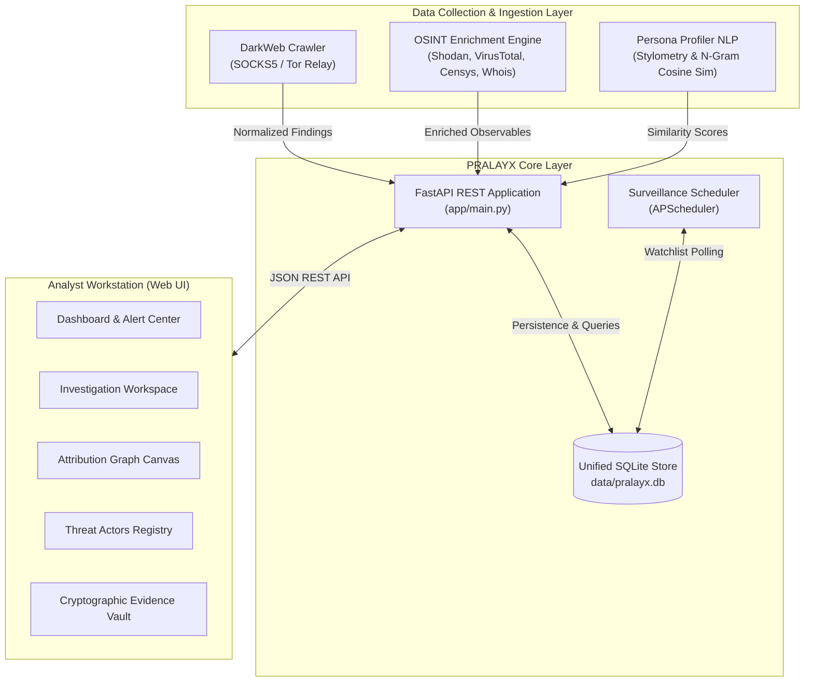

# PRALAYX — De-anonymization & Threat Intelligence Platform
> *An Enterprise-Grade Darknet Persona Attribution, OSINT Enrichment, Behavioral Stylometry, and Forensic Dossier Platform.*

---

## 🛡️ Executive Summary

**PRALAYX** is an end-to-end intelligence and de-anonymization workstation engineered to identify, correlate, and track darknet threat actors across multiple onion services, illicit forums, and communication channels.

The platform fuses technical misconfiguration harvesting, multi-provider OSINT observable enrichment, AI-driven behavioral stylometry, and force-directed graph analytics to uncover real-world identities, cross-market alias mutations, and infrastructure overlaps.

---

## 📐 System Architecture



---

## 📦 Directory Structure & Code Map

```
platform/
├── app/                        # FastAPI Backend & Core Logic
│   ├── main.py                 # Primary REST API routes, web server & endpoint handlers
│   ├── database.py             # Database Abstraction Layer & SQLite Query Engine
│   ├── engine_runner.py        # OSINT Subsystem Dispatcher & Job Executor
│   ├── crawler_runner.py       # Tor Crawler Orchestrator & Session Manager
│   ├── persona_adapter.py      # Stylometric NLP Adapter & Persona Compare Interface
│   ├── tor_bridge.py           # SOCKS5 Tor Proxy Health Check & Connection Relay
│   ├── analysis.py             # Entity Resolution & Cross-Case Correlation Engine
│   ├── reports.py              # PDF/HTML/JSON/CSV Forensic Dossier Generator
│   ├── tracking.py             # Continuous Watchlist & Interval Polling Manager
│   └── config.py               # Platform Environment Variables & Configuration
│
├── web/                        # Analyst Web Interface (Vanilla JS / CSS Workstation)
│   ├── index.html              # Intelligence Dashboard & Active Alerts Panel
│   ├── investigation.html      # Case Workspace (Overview, Findings, OSINT, Graph, Timeline)
│   ├── investigations.html     # Case Management & Intake Registry
│   ├── correlation.html        # Interactive D3/Canvas Attribution Network Canvas
│   ├── actors.html             # Threat Actors Registry & Persona Mutation Tracker
│   ├── osint.html              # Live OSINT Engine Execution & Terminal Feed
│   ├── findings.html           # Cryptographic Evidence Vault
│   ├── stylometry.html         # Persona Profiler & Text Comparison Interface
│   ├── crawl.html              # Darknet Crawler Trigger & Session Console
│   ├── monitoring.html         # Surveillance Watchlist & Security Trigger Panel
│   ├── reports.html            # Forensic Dossier & Evidence Export Hub
│   ├── app.js                  # Frontend Application Logic & API Client
│   └── app.css                 # Enterprise Dark/Light Theme Styling
│
├── shared/                     # Unified Database Schemas & Shared Specifications
│   └── schema_sqlite.sql       # SQLite DDL Definition & Foreign Key Constraints
│
├── data/                       # Operational Data Directory
│   ├── pralayx.db              # SQLite Unified Platform Database
│   └── reports/                # Generated PDF/ZIP Forensic Dossiers
│
├── seed_gyro_blackdragon.py    # Forensic Demo Data Seed Script (gyroghost & blackdragon)
├── requirements.txt            # Python Dependencies
└── vercel.json                 # Vercel Serverless Deployment Config
```

---

## ✨ Key Features

1. **Darknet Misconfiguration Harvester**: Identifies clearnet leaks, exposed `/server-status` pages, SSL/TLS certificate Subject Alternative Names (SANs), SSH banners, and descriptor email leaks.
2. **Multi-Provider OSINT Engine**: Automatically queries Shodan, VirusTotal, Censys, Whois, AbuseIPDB, and Holehe to enrich discovered IPs, domains, crypto wallets, and emails.
3. **Persona Profiler & Stylometry Engine**: Analyzes text samples using character n-gram cosine similarity, Type-Token Ratio (TTR), function word distributions, and punctuation signatures to link pseudonyms (e.g. `gyroghost` → `ghost_vortex` → `gyro_cyber`).
4. **Attribution Graph Workstation**: Force-directed network visualization correlating targets, actor handles, crypto wallets, PGP keys, IP addresses, and TLS certificates.
5. **Surveillance Watchlist & Real-Time Alerting**: Continuous background monitoring of darknet targets with automated alert generation when profile mutations or infrastructure changes occur.
6. **Forensic Dossier Export**: One-click generation of court-admissible PDF forensic dossiers and ZIP evidence packages.

---

## 🚀 Installation & Setup

### Prerequisites

- **Operating System**: Linux (Ubuntu 22.04 LTS+) or WSL2 (Windows Subsystem for Linux)
- **Python**: Python 3.10+ (Python 3.12+ recommended)
- **Tor Proxy**: Tor service running on `127.0.0.1:9050` (or Tor Browser SOCKS5 on `9150`)

### Installation Steps

1. **Clone the Repository**:
   ```bash
   git clone https://github.com/raaj7z/platform.git
   cd platform
   ```

2. **Create & Activate Virtual Environment**:
   ```bash
   python3 -m venv venv
   source venv/bin/activate
   ```

3. **Install Dependencies**:
   ```bash
   pip install --upgrade pip
   pip install -r requirements.txt
   ```

4. **Initialize Database & Demo Seed Data**:
   ```bash
   python3 seed_gyro_blackdragon.py
   ```

---

## 💻 Running the Platform

### Start the Platform Application Server

```bash
cd platform
source venv/bin/activate
uvicorn app.main:app --host 0.0.0.0 --port 8000 --reload
```

Access the Analyst Web Interface in your browser:
👉 **`http://127.0.0.1:8000/web/index.html`**

---

## 📡 REST API Reference

| Endpoint | Method | Description |
|:---|:---:|:---|
| `/api/health` | `GET` | Platform health check and service status |
| `/api/dashboard` | `GET` | Summary statistics, recent activity, and active alerts |
| `/api/investigations` | `GET` / `POST` | List or create investigations |
| `/api/investigations/{id}` | `GET` | Get full investigation details, findings, timeline & graph |
| `/api/investigations/{id}/graph` | `GET` | Attribution graph nodes & edges for an investigation |
| `/api/investigations/{id}/osint` | `POST` | Trigger manual OSINT scan for an observable |
| `/api/actors` | `GET` | List tracked threat actor entities and observed handles |
| `/api/findings` | `GET` | Query evidence findings (supports `?investigation_id=` filter) |
| `/api/persona/compare` | `POST` | Stylometric NLP comparison between two text corpora |
| `/api/watchlist` | `GET` / `POST` | Manage continuous surveillance targets |
| `/api/watchlist/{id}/scan-now` | `POST` | Trigger immediate monitoring scan |
| `/api/alerts/{id}/acknowledge` | `POST` | Acknowledge and resolve an active security alert |
| `/api/export/{id}/pdf` | `GET` | Download forensic PDF dossier report |

---

## 📜 License & Citation

Developed for Authorised use only . All rights reserved.
